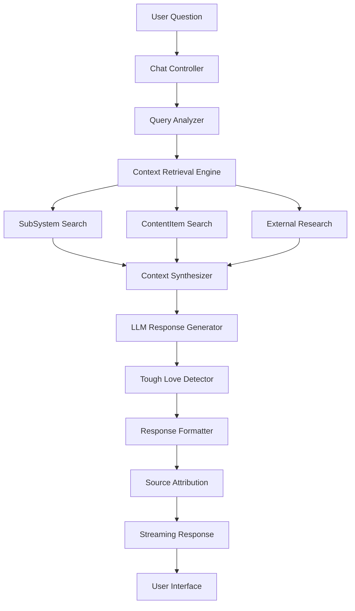

# PKA-Relate AI Chat System - Technical Design

**Version:** 1.0
**Date:** 2025-12-30
**Author:** Analyst Agent (Hive Mind)
**Status:** Design Specification

---

## Executive Summary

This document specifies the enhanced AI chat system for PKA-Relate, designed to provide relationship advice through natural language conversations with features including:

- Multi-source context retrieval from user's personal knowledge library
- Intelligent synthesis across SubSystems and ContentItems
- Non-sycophantic "tough love" mode for candid feedback
- Source citation and provenance tracking
- External research integration from thought leaders
- Real-time streaming responses

---

## Table of Contents

1. [Architecture Overview](#architecture-overview)
2. [Context Retrieval Strategy](#context-retrieval-strategy)
3. [Tough Love Mode](#tough-love-mode)
4. [Source Citation System](#source-citation-system)
5. [External Research Integration](#external-research-integration)
6. [Response Format](#response-format)
7. [Implementation Patterns](#implementation-patterns)
8. [Data Models](#data-models)
9. [System Prompts](#system-prompts)
10. [Integration Points](#integration-points)

---

## Architecture Overview

### System Components



### Technology Stack

- **Vector Database:** RuVector (existing) for semantic similarity
- **Embedding Model:** 384-dimensional n-gram embeddings (existing)
- **LLM Provider:** Claude 3.5 Sonnet (recommended for relationship advice)
- **Graph Storage:** In-memory graph store (existing) for SubSystem relationships
- **Search Strategy:** Hybrid vector + graph traversal
- **Streaming:** Server-Sent Events (SSE) or WebSocket

### Component Responsibilities

| Component | Responsibility |
|-----------|----------------|
| **Query Analyzer** | Extract intent, detect emotional tone, identify key entities |
| **Context Retrieval Engine** | Multi-source semantic search across user's library |
| **Context Synthesizer** | Merge and deduplicate relevant information |
| **Tough Love Detector** | Identify when candid feedback is appropriate |
| **Response Generator** | Create empathetic, citation-rich responses |
| **Source Attribution** | Track provenance and display citations |

---

## Context Retrieval Strategy

### Multi-Source Search Architecture

The system searches three primary sources in parallel:

1. **SubSystems** - User's organized knowledge domains
2. **ContentItems** - Notes, articles, books, podcasts within SubSystems
3. **External Sources** - Cached thought leader content

### Search Flow

```typescript
async function retrieveContext(query: string, userId: string): Promise<RetrievalResult> {
  // 1. Parallel search across all sources
  const [subSystemResults, contentResults, externalResults] = await Promise.all([
    searchSubSystems(query, userId),
    searchContentItems(query, userId),
    searchExternalCache(query)
  ]);

  // 2. Hybrid scoring: vector similarity + graph connectivity
  const rankedResults = hybridRank([
    ...subSystemResults,
    ...contentResults,
    ...externalResults
  ]);

  // 3. Apply relevance threshold and deduplicate
  const filteredResults = rankedResults
    .filter(r => r.combinedScore > 0.4)
    .slice(0, 8); // Top 8 sources

  // 4. Build context with provenance
  return {
    sources: filteredResults,
    context: synthesizeContext(filteredResults),
    provenanceChain: buildProvenanceChain(filteredResults)
  };
}
```

### SubSystem Search Implementation

```typescript
interface SubSystemSearchConfig {
  userId: string;
  query: string;
  maxResults: number;
  includeLinkedSystems: boolean;
}

async function searchSubSystems(
  query: string,
  userId: string
): Promise<ContextSource[]> {
  // 1. Get user's SubSystems
  const userSystems = await db.subSystems
    .where('user_id', userId)
    .select('id', 'name', 'description');

  // 2. Generate query embedding
  const queryEmbedding = await embedOne(query, 384);

  // 3. Search vector store with SubSystem filter
  const results = await vectorStore.search(queryEmbedding, 20, {
    filters: {
      source: { $in: userSystems.map(s => s.id) },
      tier: 'hot' // Prioritize frequently accessed
    }
  });

  // 4. Map to ContextSource
  return results.map(r => ({
    id: r.id,
    type: 'subsystem',
    title: r.metadata.title || 'Untitled',
    subSystemName: userSystems.find(s => s.id === r.metadata.source)?.name,
    snippet: r.metadata.text.substring(0, 300),
    vectorScore: r.score,
    graphScore: 0, // Will be enhanced below
    combinedScore: r.score
  }));
}
```

### ContentItem Search Implementation

```typescript
async function searchContentItems(
  query: string,
  userId: string
): Promise<ContextSource[]> {
  // 1. Get all user's ContentItems
  const userItems = await db.contentItems
    .where('user_id', userId)
    .select('id', 'system_id', 'type', 'title', 'highlights', 'personal_notes');

  // 2. Build searchable text corpus
  const itemTexts = userItems.map(item => {
    const textParts = [
      item.title,
      item.highlights?.join(' '),
      item.personal_notes
    ].filter(Boolean);
    return {
      id: item.id,
      text: textParts.join('\n\n'),
      systemId: item.system_id,
      type: item.type,
      title: item.title
    };
  });

  // 3. Search vector store
  const queryEmbedding = await embedOne(query, 384);
  const vectorResults = await vectorStore.search(queryEmbedding, 30);

  // 4. Filter to user's items and map
  const userResultIds = new Set(userItems.map(i => i.id));
  return vectorResults
    .filter(r => userResultIds.has(r.id))
    .map(r => {
      const item = userItems.find(i => i.id === r.id)!;
      return {
        id: r.id,
        type: 'content_item',
        contentType: item.type,
        title: r.metadata.title,
        snippet: r.metadata.text.substring(0, 300),
        systemId: item.system_id,
        vectorScore: r.score,
        graphScore: 0,
        combinedScore: r.score
      };
    });
}
```

### Hybrid Ranking with Graph Enhancement

```typescript
interface HybridRankConfig {
  vectorWeight: number;  // Default 0.6
  graphWeight: number;   // Default 0.4
}

function hybridRank(
  sources: ContextSource[],
  config: HybridRankConfig = { vectorWeight: 0.6, graphWeight: 0.4 }
): ContextSource[] {
  // 1. Build SubSystem connectivity graph
  const systemGraph = buildSystemConnectivityGraph(sources);

  // 2. Compute graph scores using PageRank-like algorithm
  const graphScores = computeGraphCentrality(systemGraph);

  // 3. Combine vector and graph scores
  return sources.map(source => {
    const graphScore = graphScores[source.id] || 0;
    const combinedScore =
      (source.vectorScore * config.vectorWeight) +
      (graphScore * config.graphWeight);

    return {
      ...source,
      graphScore,
      combinedScore
    };
  }).sort((a, b) => b.combinedScore - a.combinedScore);
}

function buildSystemConnectivityGraph(sources: ContextSource[]): Graph {
  // Build graph where:
  // - Nodes = SubSystems
  // - Edges = linked_system_ids relationships
  // - Weight = number of shared ContentItems

  const graph = new Map<string, Set<string>>();

  sources.forEach(source => {
    if (source.type === 'subsystem' || source.systemId) {
      const systemId = source.type === 'subsystem' ? source.id : source.systemId!;

      // Add edges based on SubSystem.linked_system_ids
      const linkedSystems = getLinkedSystems(systemId);
      if (!graph.has(systemId)) {
        graph.set(systemId, new Set());
      }
      linkedSystems.forEach(linked => {
        graph.get(systemId)!.add(linked);
      });
    }
  });

  return graph;
}

function computeGraphCentrality(graph: Graph): Record<string, number> {
  // Simple PageRank implementation
  const damping = 0.85;
  const iterations = 20;

  let scores: Record<string, number> = {};
  const nodes = Array.from(graph.keys());

  // Initialize
  nodes.forEach(node => scores[node] = 1 / nodes.length);

  // Iterate
  for (let i = 0; i < iterations; i++) {
    const newScores: Record<string, number> = {};

    nodes.forEach(node => {
      let sum = 0;
      nodes.forEach(other => {
        if (graph.get(other)?.has(node)) {
          sum += scores[other]! / graph.get(other)!.size;
        }
      });

      newScores[node] = (1 - damping) / nodes.length + damping * sum;
    });

    scores = newScores;
  }

  return scores;
}
```

### Context Synthesis

```typescript
interface SynthesizedContext {
  summary: string;
  topSources: ContextSource[];
  relatedSystems: string[];
  confidence: number;
}

function synthesizeContext(sources: ContextSource[]): SynthesizedContext {
  // 1. Group by SubSystem
  const bySystem = groupBy(sources, s =>
    s.type === 'subsystem' ? s.id : s.systemId
  );

  // 2. Build context summary
  const contextParts = sources.slice(0, 5).map((source, idx) => {
    return `[Source ${idx + 1}] ${source.title}\n${source.snippet}`;
  });

  // 3. Extract related systems
  const relatedSystems = Array.from(
    new Set(sources.map(s => s.subSystemName).filter(Boolean))
  );

  // 4. Calculate confidence based on scores
  const avgScore = sources.reduce((sum, s) => sum + s.combinedScore, 0) / sources.length;

  return {
    summary: contextParts.join('\n\n---\n\n'),
    topSources: sources.slice(0, 5),
    relatedSystems: relatedSystems as string[],
    confidence: avgScore
  };
}
```

---

## Tough Love Mode

### Detection Algorithm

The "tough love" mode is activated when:

1. User asks repetitive questions about the same issue
2. User exhibits avoidance patterns
3. User requests validation for clearly problematic behavior
4. System detects emotional reasoning vs. logical analysis

```typescript
interface ToughLoveAnalysis {
  shouldActivate: boolean;
  confidence: number;
  reasons: string[];
  patterns: DetectedPattern[];
}

async function detectToughLoveNeed(
  query: string,
  conversationHistory: ChatMessage[],
  userSettings: UserSettings
): Promise<ToughLoveAnalysis> {
  // 1. Check if user has enabled tough love mode
  if (!userSettings.tough_love_mode_enabled) {
    return {
      shouldActivate: false,
      confidence: 0,
      reasons: [],
      patterns: []
    };
  }

  const patterns: DetectedPattern[] = [];
  const reasons: string[] = [];

  // 2. Detect repetitive questioning
  const repetitionScore = detectRepetition(query, conversationHistory);
  if (repetitionScore > 0.7) {
    patterns.push({
      type: 'repetitive_questioning',
      confidence: repetitionScore
    });
    reasons.push('User has asked similar questions multiple times');
  }

  // 3. Detect avoidance language
  const avoidanceScore = detectAvoidance(query);
  if (avoidanceScore > 0.6) {
    patterns.push({
      type: 'avoidance',
      confidence: avoidanceScore
    });
    reasons.push('Query shows avoidance of core issue');
  }

  // 4. Detect validation-seeking
  const validationScore = detectValidationSeeking(query);
  if (validationScore > 0.7) {
    patterns.push({
      type: 'validation_seeking',
      confidence: validationScore
    });
    reasons.push('User may be seeking validation rather than growth');
  }

  // 5. Check against user's core values for misalignment
  const userValues = await getUserCoreValues(userSettings.user_id);
  const valueAlignment = checkValueAlignment(query, userValues);
  if (valueAlignment < 0.5) {
    patterns.push({
      type: 'value_misalignment',
      confidence: 1 - valueAlignment
    });
    reasons.push('Query suggests actions misaligned with stated values');
  }

  // 6. Calculate overall confidence
  const confidence = patterns.reduce((sum, p) => sum + p.confidence, 0) /
                     Math.max(patterns.length, 1);

  return {
    shouldActivate: confidence > 0.6 && patterns.length >= 2,
    confidence,
    reasons,
    patterns
  };
}

function detectRepetition(
  query: string,
  history: ChatMessage[]
): number {
  const recentQueries = history
    .filter(m => m.type === 'user')
    .slice(-10)
    .map(m => m.content);

  const queryEmbedding = embedOne(query, 384);
  const similarities = recentQueries.map(q =>
    cosineSimilarity(queryEmbedding, embedOne(q, 384))
  );

  const maxSimilarity = Math.max(...similarities, 0);
  const avgSimilarity = similarities.reduce((a, b) => a + b, 0) / similarities.length;

  return (maxSimilarity * 0.7) + (avgSimilarity * 0.3);
}

function detectAvoidance(query: string): number {
  const avoidancePatterns = [
    /\b(maybe|might|could|possibly|perhaps)\b/gi,
    /\b(I don't know|not sure|unclear)\b/gi,
    /\b(but|however|although)\b.*\b(reason|excuse|explain)\b/gi,
    /\b(they|he|she|them)\b.*\b(made me|caused|forced)\b/gi // External locus of control
  ];

  let score = 0;
  avoidancePatterns.forEach(pattern => {
    const matches = query.match(pattern);
    if (matches) {
      score += matches.length * 0.2;
    }
  });

  return Math.min(score, 1.0);
}

function detectValidationSeeking(query: string): number {
  const validationPatterns = [
    /\b(right|wrong|okay|fine|acceptable)\b.*\b(to|if I)\b/gi,
    /\b(should I|is it okay|am I)\b/gi,
    /\b(tell me|reassure|confirm)\b.*\b(that|it's)\b/gi,
    /\b(just|only|simply)\b/gi // Minimization
  ];

  let score = 0;
  validationPatterns.forEach(pattern => {
    const matches = query.match(pattern);
    if (matches) {
      score += matches.length * 0.25;
    }
  });

  return Math.min(score, 1.0);
}

async function checkValueAlignment(
  query: string,
  userValues: CoreValue[]
): Promise<number> {
  // Extract action/intention from query
  const intention = extractIntention(query);

  // Compare with user's primary and secondary values
  const primaryValues = userValues.filter(v => v.category === 'Primary');
  const alignmentScores = primaryValues.map(value => {
    return semanticSimilarity(intention, value.value);
  });

  return Math.max(...alignmentScores, 0);
}
```

### System Prompt Modification

When tough love mode is activated, the system prompt is modified:

```typescript
function buildSystemPrompt(
  isToughLove: boolean,
  userProfile: PsychologicalProfile,
  coreValues: CoreValue[]
): string {
  const basePrompt = `You are a relationship advisor for PKA-Relate. You have access to the user's personal knowledge library and must cite specific sources in your responses.

User Profile:
- Attachment Style: ${userProfile.attachment_style}
- Communication Style: ${userProfile.communication_style}
- Conflict Pattern: ${userProfile.conflict_pattern}

Core Values:
${coreValues.map(v => `- ${v.category}: ${v.value}`).join('\n')}`;

  if (isToughLove) {
    return basePrompt + `

TOUGH LOVE MODE ACTIVATED:
The user has shown patterns suggesting they need candid, challenging feedback rather than comfortable validation. Your response should:

1. **Challenge Blind Spots:** Directly address avoidance, rationalization, or self-deception
2. **Reference Their Values:** Point out misalignment with their stated core values
3. **Avoid Coddling:** Be compassionate but firm; growth requires discomfort
4. **Provide Actionable Truth:** Offer clear, specific steps grounded in their own knowledge library
5. **Maintain Respect:** Tough love is not harsh criticism; maintain empathy while being direct

Remember: The user has explicitly opted into this mode. They want growth, not comfort.`;
  }

  return basePrompt + `

Your response should:
1. Synthesize information from multiple sources in their library
2. Cite specific sources with titles and authors
3. Connect advice to their psychological profile and values
4. Be empathetic and supportive
5. Offer both emotional validation and practical guidance`;
}
```

---

## Source Citation System

### Data Model

```typescript
interface ChatSource {
  id: string;                    // Source identifier
  type: 'subsystem' | 'content_item' | 'external';
  title: string;                 // Display title
  author?: string;               // Author name (for content items)
  contentType?: ContentType;     // article, book, video, podcast, note
  subSystemName?: string;        // Parent SubSystem name
  snippet: string;               // Relevant excerpt
  url?: string;                  // External URL if applicable
  score: number;                 // Relevance score (0-1)
  highlightedText?: string;      // User's highlights from this source
  personalNote?: string;         // User's personal notes
  provenanceLevel: number;       // Depth in provenance chain (0 = direct)
}

interface ProvenanceChain {
  sources: ChatSource[];
  relationships: SourceRelationship[];
  synthesisPath: string[];       // How sources were combined
}

interface SourceRelationship {
  from: string;                  // Source ID
  to: string;                    // Related source ID
  type: 'linked_system' | 'references' | 'contradicts' | 'supports';
  strength: number;              // 0-1
}
```

### Source Tracking During Response Generation

```typescript
class SourceTracker {
  private sources: Map<string, ChatSource> = new Map();
  private relationships: SourceRelationship[] = [];
  private citationIndex = 1;

  addSource(source: ChatSource): string {
    // Generate citation marker
    const marker = `[${this.citationIndex}]`;
    this.citationIndex++;

    this.sources.set(source.id, {
      ...source,
      marker
    });

    return marker;
  }

  addRelationship(from: string, to: string, type: string, strength: number): void {
    this.relationships.push({ from, to, type, strength });
  }

  buildProvenanceChain(): ProvenanceChain {
    const sortedSources = Array.from(this.sources.values())
      .sort((a, b) => b.score - a.score);

    return {
      sources: sortedSources,
      relationships: this.relationships,
      synthesisPath: this.buildSynthesisPath(sortedSources)
    };
  }

  private buildSynthesisPath(sources: ChatSource[]): string[] {
    // Describe how sources were combined
    const path: string[] = [];

    const bySystem = groupBy(sources, s => s.subSystemName);
    Object.entries(bySystem).forEach(([system, systemSources]) => {
      path.push(
        `Drew from ${systemSources.length} sources in ${system} SubSystem`
      );
    });

    const externalSources = sources.filter(s => s.type === 'external');
    if (externalSources.length > 0) {
      path.push(
        `Integrated ${externalSources.length} external research sources`
      );
    }

    return path;
  }
}
```

### Citation Formatting

```typescript
function formatResponseWithCitations(
  content: string,
  sources: ChatSource[]
): string {
  let formattedContent = content;

  // 1. Inline citations (already in content as [1], [2], etc.)

  // 2. Append citation list
  const citationList = sources.map((source, idx) => {
    const parts = [
      `**[${idx + 1}] ${source.title}**`
    ];

    if (source.author) {
      parts.push(`by ${source.author}`);
    }

    if (source.subSystemName) {
      parts.push(`(${source.subSystemName} SubSystem)`);
    }

    if (source.contentType) {
      parts.push(`_${source.contentType}_`);
    }

    if (source.highlightedText) {
      parts.push(`\n> "${source.highlightedText}"`);
    }

    return parts.join(' • ');
  }).join('\n\n');

  return `${formattedContent}\n\n---\n\n### Sources\n\n${citationList}`;
}
```

### Source Citation in UI

The frontend should display sources in two formats:

1. **Inline Citations:** Clickable markers like [1], [2] that open source detail sheets
2. **Source Cards:** Bottom sheet showing full source details

```typescript
// Frontend component structure
interface SourceCard {
  source: ChatSource;
  onViewFull: () => void;      // Navigate to ContentItem or SubSystem
  onSaveHighlight: () => void; // Save snippet to highlights
}

// Example React component
function ChatSourceCard({ source, onViewFull, onSaveHighlight }: SourceCard) {
  return (
    <Card className="mb-2">
      <CardHeader>
        <div className="flex justify-between">
          <h4 className="font-semibold">{source.title}</h4>
          <Badge>{source.contentType || 'subsystem'}</Badge>
        </div>
        {source.author && <p className="text-sm text-muted">{source.author}</p>}
      </CardHeader>
      <CardContent>
        <p className="text-sm">{source.snippet}</p>
        {source.highlightedText && (
          <blockquote className="border-l-4 pl-4 mt-2 italic">
            {source.highlightedText}
          </blockquote>
        )}
      </CardContent>
      <CardFooter>
        <Button variant="ghost" onClick={onViewFull}>View Full</Button>
        <Button variant="ghost" onClick={onSaveHighlight}>Save Snippet</Button>
      </CardFooter>
    </Card>
  );
}
```

---

## External Research Integration

### Thought Leader Cache

Maintain a cached database of content from relationship thought leaders:

```typescript
interface ExternalSource {
  id: string;
  author: string;               // e.g., "Esther Perel"
  title: string;
  type: 'article' | 'book' | 'video' | 'podcast' | 'excerpt';
  url: string;
  content: string;              // Full text or transcript
  publicationDate: string;
  topics: string[];             // e.g., ["attachment", "communication", "boundaries"]
  cachedAt: string;
  lastVerified: string;
}

const THOUGHT_LEADERS = [
  'Esther Perel',
  'John Gottman',
  'Sue Johnson',
  'Brené Brown',
  'Terry Real',
  'Harville Hendrix',
  'Stan Tatkin',
  'Alexandra Solomon'
];
```

### Web Search Integration

For fresh content, integrate with web search APIs:

```typescript
interface WebSearchConfig {
  apiKey: string;
  maxResults: number;
  recencyDays: number;          // Only fetch recent content
}

async function searchThoughtLeaders(
  query: string,
  config: WebSearchConfig
): Promise<ExternalSource[]> {
  const searchQueries = THOUGHT_LEADERS.map(leader =>
    `${query} ${leader} site:psychologytoday.com OR site:gottman.com OR site:estherperel.com`
  );

  // Use web search API (e.g., Brave Search, Serper, etc.)
  const results = await Promise.all(
    searchQueries.map(q => webSearchAPI.search(q, {
      maxResults: 3,
      recency: config.recencyDays
    }))
  );

  // Flatten and deduplicate
  const allResults = results.flat();
  const uniqueUrls = new Set<string>();

  return allResults.filter(r => {
    if (uniqueUrls.has(r.url)) return false;
    uniqueUrls.add(r.url);
    return true;
  }).map(r => ({
    id: generateId(),
    author: extractAuthor(r),
    title: r.title,
    type: inferType(r.url),
    url: r.url,
    content: r.snippet, // Full content fetched asynchronously
    publicationDate: r.publishedDate,
    topics: extractTopics(r.content),
    cachedAt: new Date().toISOString(),
    lastVerified: new Date().toISOString()
  }));
}
```

### Caching Strategy

```typescript
class ExternalContentCache {
  private db: Database;
  private ttl = 30 * 24 * 60 * 60 * 1000; // 30 days

  async get(query: string): Promise<ExternalSource[]> {
    // 1. Check cache
    const cached = await this.db.externalSources
      .where('topics', 'array-contains-any', extractKeywords(query))
      .where('cachedAt', '>', Date.now() - this.ttl)
      .limit(5)
      .get();

    if (cached.length > 0) {
      return cached;
    }

    // 2. Fetch fresh content
    const fresh = await searchThoughtLeaders(query, {
      apiKey: process.env.SEARCH_API_KEY!,
      maxResults: 5,
      recencyDays: 90
    });

    // 3. Cache results
    await this.db.externalSources.insertMany(fresh);

    return fresh;
  }

  async prewarm(topics: string[]): Promise<void> {
    // Background job to pre-cache common topics
    for (const topic of topics) {
      await this.get(topic);
    }
  }
}

// Pre-cache common relationship topics
const COMMON_TOPICS = [
  'attachment styles',
  'communication in relationships',
  'conflict resolution',
  'boundaries',
  'emotional intimacy',
  'trust building',
  'relationship patterns'
];
```

### Attribution Requirements

All external sources must be clearly attributed:

```typescript
interface ExternalSourceAttribution {
  source: ExternalSource;
  citationFormat: 'APA' | 'inline';
  disclaimer: string;
}

function formatExternalAttribution(source: ExternalSource): string {
  return `**[External Source]** "${source.title}" by ${source.author}
Source: ${source.url}
${source.publicationDate ? `Published: ${new Date(source.publicationDate).toLocaleDateString()}` : ''}

_Note: This is external content cached for your reference. PKA-Relate does not claim ownership._`;
}
```

---

## Response Format

### Enhanced ChatMessage Interface

```typescript
interface ChatMessage {
  id: string;
  user_id: string;
  conversation_id: string;
  type: 'user' | 'assistant';
  content: string;

  // Enhanced fields
  sources?: ChatSource[];
  provenance?: ProvenanceChain;
  is_tough_love?: boolean;
  tough_love_reasons?: string[];

  // Metadata
  confidence: number;           // 0-1 based on source quality
  synthesizedFrom: number;      // Number of sources synthesized
  includesExternal: boolean;    // Whether external sources used

  // Feedback
  feedback?: 'positive' | 'negative';
  feedbackNote?: string;

  created_at: timestamp;
}

interface ChatConversation {
  id: string;
  user_id: string;
  title: string;                // Auto-generated from first message
  messageCount: number;
  lastMessageAt: timestamp;
  tags: string[];               // Auto-tagged based on topics
  relatedSystems: string[];     // SubSystems referenced
  created_at: timestamp;
}
```

### Streaming Response Format

Use Server-Sent Events for real-time streaming:

```typescript
// Server-side streaming
async function* streamChatResponse(
  query: string,
  context: SynthesizedContext,
  systemPrompt: string
): AsyncGenerator<StreamChunk> {
  // 1. Initialize response
  yield {
    type: 'start',
    conversationId: generateId(),
    messageId: generateId()
  };

  // 2. Stream sources
  for (const source of context.topSources) {
    yield {
      type: 'source',
      source: source
    };
  }

  // 3. Stream LLM response
  const llmStream = await anthropic.messages.stream({
    model: 'claude-3-5-sonnet-20241022',
    messages: [{ role: 'user', content: query }],
    system: systemPrompt
  });

  for await (const chunk of llmStream) {
    if (chunk.type === 'content_block_delta') {
      yield {
        type: 'content',
        delta: chunk.delta.text
      };
    }
  }

  // 4. Finalize with metadata
  yield {
    type: 'complete',
    metadata: {
      confidence: context.confidence,
      sourceCount: context.topSources.length,
      isToughLove: systemPrompt.includes('TOUGH LOVE')
    }
  };
}

// Client-side consumption
const eventSource = new EventSource('/api/chat/stream');
let fullContent = '';
let sources: ChatSource[] = [];

eventSource.addEventListener('source', (e) => {
  sources.push(JSON.parse(e.data));
  updateSourcesUI(sources);
});

eventSource.addEventListener('content', (e) => {
  fullContent += JSON.parse(e.data).delta;
  updateMessageUI(fullContent);
});

eventSource.addEventListener('complete', (e) => {
  const metadata = JSON.parse(e.data);
  finalizeMessageUI(metadata);
  eventSource.close();
});
```

### Response Quality Metrics

Track response quality for continuous improvement:

```typescript
interface ResponseQualityMetrics {
  messageId: string;
  metrics: {
    sourceRelevance: number;     // Avg score of sources used
    sourceDiv ersity: number;     // Number of different SubSystems
    externalUsage: number;        // Percentage external sources
    citationDensity: number;      // Citations per 100 words
    userFeedback?: 'positive' | 'negative';
    timeToResponse: number;       // Milliseconds
  };
  calculatedAt: timestamp;
}

function calculateResponseQuality(
  message: ChatMessage,
  context: SynthesizedContext
): ResponseQualityMetrics {
  const sources = message.sources || [];
  const sourceRelevance = sources.reduce((sum, s) => sum + s.score, 0) / sources.length;

  const uniqueSystems = new Set(sources.map(s => s.subSystemName)).size;
  const sourceDiversity = uniqueSystems / Math.max(sources.length, 1);

  const externalCount = sources.filter(s => s.type === 'external').length;
  const externalUsage = externalCount / Math.max(sources.length, 1);

  const wordCount = message.content.split(/\s+/).length;
  const citationCount = (message.content.match(/\[\d+\]/g) || []).length;
  const citationDensity = (citationCount / wordCount) * 100;

  return {
    messageId: message.id,
    metrics: {
      sourceRelevance,
      sourceDiversity,
      externalUsage,
      citationDensity,
      timeToResponse: 0 // Set by timing middleware
    },
    calculatedAt: new Date().toISOString()
  };
}
```

---

## Implementation Patterns

### Service Architecture

```typescript
// services/chat/ChatService.ts
class ChatService {
  constructor(
    private contextRetrieval: ContextRetrievalService,
    private toughLoveDetector: ToughLoveDetectorService,
    private responseGenerator: ResponseGeneratorService,
    private sourceTracker: SourceTrackerService
  ) {}

  async processMessage(
    userId: string,
    conversationId: string,
    message: string
  ): Promise<ChatMessage> {
    // 1. Retrieve context
    const context = await this.contextRetrieval.retrieve(message, userId);

    // 2. Check tough love need
    const history = await this.getConversationHistory(conversationId);
    const userSettings = await this.getUserSettings(userId);
    const toughLove = await this.toughLoveDetector.analyze(
      message,
      history,
      userSettings
    );

    // 3. Generate response
    const systemPrompt = this.buildSystemPrompt(
      toughLove.shouldActivate,
      await this.getUserProfile(userId),
      await this.getUserValues(userId)
    );

    const response = await this.responseGenerator.generate(
      message,
      context,
      systemPrompt
    );

    // 4. Track sources
    const provenance = this.sourceTracker.buildProvenanceChain();

    // 5. Save and return
    const chatMessage: ChatMessage = {
      id: generateId(),
      user_id: userId,
      conversation_id: conversationId,
      type: 'assistant',
      content: response.content,
      sources: context.topSources,
      provenance,
      is_tough_love: toughLove.shouldActivate,
      tough_love_reasons: toughLove.reasons,
      confidence: context.confidence,
      synthesizedFrom: context.topSources.length,
      includesExternal: context.topSources.some(s => s.type === 'external'),
      created_at: new Date()
    };

    await this.saveMessage(chatMessage);
    return chatMessage;
  }
}
```

### Dependency Injection

```typescript
// di/container.ts
import { Container } from 'inversify';

const container = new Container();

// Services
container.bind<ChatService>('ChatService').to(ChatService);
container.bind<ContextRetrievalService>('ContextRetrievalService').to(ContextRetrievalService);
container.bind<ToughLoveDetectorService>('ToughLoveDetectorService').to(ToughLoveDetectorService);
container.bind<ResponseGeneratorService>('ResponseGeneratorService').to(ResponseGeneratorService);
container.bind<SourceTrackerService>('SourceTrackerService').to(SourceTrackerService);

// Repositories
container.bind<UnifiedMemory>('UnifiedMemory').toConstantValue(
  createUnifiedMemory()
);

export { container };
```

### API Routes

```typescript
// api/routes/chat.ts (enhanced)
router.post('/conversations/:id/messages', async (req, res) => {
  const { message } = req.body;
  const conversationId = req.params.id;
  const userId = req.user.id; // From auth middleware

  const chatService = container.get<ChatService>('ChatService');

  // Stream response
  res.setHeader('Content-Type', 'text/event-stream');
  res.setHeader('Cache-Control', 'no-cache');
  res.setHeader('Connection', 'keep-alive');

  try {
    const stream = await chatService.streamResponse(
      userId,
      conversationId,
      message
    );

    for await (const chunk of stream) {
      res.write(`data: ${JSON.stringify(chunk)}\n\n`);
    }

    res.write('data: [DONE]\n\n');
    res.end();
  } catch (error) {
    res.write(`data: ${JSON.stringify({ type: 'error', error: error.message })}\n\n`);
    res.end();
  }
});

router.post('/conversations/:id/feedback', async (req, res) => {
  const { messageId, feedback, note } = req.body;
  const conversationId = req.params.id;

  await db.chatMessages.update(messageId, {
    feedback,
    feedbackNote: note
  });

  // Track for model improvement
  await trackFeedback(messageId, feedback);

  res.status(204).send();
});
```

---

## Data Models

### Database Schema (Supabase)

```sql
-- Chat Conversations
CREATE TABLE chat_conversations (
  id UUID PRIMARY KEY DEFAULT uuid_generate_v4(),
  user_id UUID NOT NULL REFERENCES users(id) ON DELETE CASCADE,
  title TEXT NOT NULL,
  message_count INTEGER DEFAULT 0,
  last_message_at TIMESTAMPTZ,
  tags TEXT[],
  related_systems UUID[],
  created_at TIMESTAMPTZ DEFAULT NOW(),
  updated_at TIMESTAMPTZ DEFAULT NOW()
);

CREATE INDEX idx_chat_conversations_user ON chat_conversations(user_id);
CREATE INDEX idx_chat_conversations_updated ON chat_conversations(updated_at DESC);

-- Chat Messages
CREATE TABLE chat_messages (
  id UUID PRIMARY KEY DEFAULT uuid_generate_v4(),
  user_id UUID NOT NULL REFERENCES users(id) ON DELETE CASCADE,
  conversation_id UUID NOT NULL REFERENCES chat_conversations(id) ON DELETE CASCADE,
  type TEXT NOT NULL CHECK (type IN ('user', 'assistant')),
  content TEXT NOT NULL,
  sources JSONB,
  provenance JSONB,
  is_tough_love BOOLEAN DEFAULT FALSE,
  tough_love_reasons TEXT[],
  confidence DECIMAL(3,2),
  synthesized_from INTEGER DEFAULT 0,
  includes_external BOOLEAN DEFAULT FALSE,
  feedback TEXT CHECK (feedback IN ('positive', 'negative')),
  feedback_note TEXT,
  created_at TIMESTAMPTZ DEFAULT NOW()
);

CREATE INDEX idx_chat_messages_conversation ON chat_messages(conversation_id, created_at);
CREATE INDEX idx_chat_messages_user ON chat_messages(user_id);
CREATE INDEX idx_chat_messages_feedback ON chat_messages(feedback) WHERE feedback IS NOT NULL;

-- External Source Cache
CREATE TABLE external_sources (
  id UUID PRIMARY KEY DEFAULT uuid_generate_v4(),
  author TEXT NOT NULL,
  title TEXT NOT NULL,
  type TEXT NOT NULL,
  url TEXT UNIQUE NOT NULL,
  content TEXT,
  publication_date TIMESTAMPTZ,
  topics TEXT[],
  cached_at TIMESTAMPTZ DEFAULT NOW(),
  last_verified TIMESTAMPTZ DEFAULT NOW(),
  access_count INTEGER DEFAULT 0
);

CREATE INDEX idx_external_sources_author ON external_sources(author);
CREATE INDEX idx_external_sources_topics ON external_sources USING GIN(topics);
CREATE INDEX idx_external_sources_cached ON external_sources(cached_at DESC);

-- Chat Quality Metrics
CREATE TABLE chat_quality_metrics (
  message_id UUID PRIMARY KEY REFERENCES chat_messages(id) ON DELETE CASCADE,
  source_relevance DECIMAL(3,2),
  source_diversity DECIMAL(3,2),
  external_usage DECIMAL(3,2),
  citation_density DECIMAL(5,2),
  time_to_response INTEGER,
  calculated_at TIMESTAMPTZ DEFAULT NOW()
);

-- Conversation triggers
CREATE OR REPLACE FUNCTION update_conversation_metadata()
RETURNS TRIGGER AS $$
BEGIN
  UPDATE chat_conversations
  SET
    message_count = message_count + 1,
    last_message_at = NEW.created_at,
    updated_at = NOW()
  WHERE id = NEW.conversation_id;
  RETURN NEW;
END;
$$ LANGUAGE plpgsql;

CREATE TRIGGER chat_message_inserted
AFTER INSERT ON chat_messages
FOR EACH ROW
EXECUTE FUNCTION update_conversation_metadata();
```

---

## System Prompts

### Base System Prompt

```text
You are an AI relationship advisor integrated into PKA-Relate, a personal knowledge assistant. Your role is to help users navigate relationship challenges using their own accumulated wisdom and insights from thought leaders.

CAPABILITIES:
- Access to the user's personal knowledge library organized into SubSystems
- User's highlighted content from articles, books, podcasts, and videos
- User's personal notes and reflections
- Cached content from relationship thought leaders
- User's psychological profile and core values

REQUIREMENTS:
1. **Cite Sources:** Always reference specific sources from the user's library. Use inline citations [1], [2] and provide full source details.
2. **Multi-Source Synthesis:** Draw from multiple sources when possible. Show how different insights connect.
3. **Respect Profile:** Tailor advice to the user's attachment style, communication style, and conflict patterns.
4. **Honor Values:** Align recommendations with the user's stated core values.
5. **Be Specific:** Avoid generic advice. Use concrete examples from their library.
6. **Acknowledge Gaps:** If the library lacks relevant information, clearly state this and suggest what to research.

RESPONSE FORMAT:
1. Direct answer to the question
2. Supporting evidence with citations
3. Connection to user's values/profile
4. Specific actionable steps
5. Full source list at the end

Remember: You're not just answering questions, you're helping the user leverage their own accumulated knowledge.
```

### Tough Love Mode System Prompt Addition

```text
TOUGH LOVE MODE ACTIVATED

The user has enabled candid feedback mode and exhibited patterns suggesting they need challenging perspectives:
${toughLoveReasons.map(r => `- ${r}`).join('\n')}

ADDITIONAL REQUIREMENTS:
1. **Challenge Directly:** Address avoidance, rationalization, or self-deception head-on
2. **Reference Their Own Words:** Use their highlights and notes to show contradictions
3. **Value Alignment:** Explicitly point out when actions misalign with stated values
4. **Avoid Coddling:** Growth requires discomfort. Be compassionate but firm
5. **Demand Accountability:** Ask difficult questions they're avoiding
6. **Offer Hard Truths:** If their library sources contradict their narrative, state it clearly

TONE:
- Firm but respectful
- Empathetic but not enabling
- Direct but not harsh
- Growth-focused, not punitive

Example:
❌ "It's understandable you feel that way..."
✅ "You've highlighted passages about accountability [1], but your question suggests avoiding responsibility. Let's explore this discrepancy..."
```

### Example Prompt for User with Anxious Attachment

```text
You are an AI relationship advisor for PKA-Relate.

USER PROFILE:
- Attachment Style: Anxious
- Communication Style: Indirect
- Conflict Pattern: Pursuer-Withdrawer (Pursuer role)

CORE VALUES:
- Primary: Authenticity, Connection
- Secondary: Growth, Vulnerability
- Aspirational: Self-Compassion

AVAILABLE KNOWLEDGE:
The user has 127 items across 5 SubSystems:
- Dating (34 items)
- General (28 items)
- Management (12 items)
- Femininity (31 items)
- Masculinity (22 items)

Recent highlights include content from:
- "Attached" by Amir Levine (attachment theory)
- "Nonviolent Communication" by Marshall Rosenberg
- Esther Perel's podcast episodes

Given the user's anxious attachment style, be especially mindful of:
1. Validating emotions while encouraging self-soothing
2. Highlighting their value of "Authenticity" when they self-abandon
3. Drawing from their "Attached" highlights about protest behaviors
4. Offering concrete communication scripts (aligns with their NVC notes)

[Continue with base system prompt requirements...]
```

---

## Integration Points

### With SubSystem Management

```typescript
// When user adds content to a SubSystem, index it for chat
async function onContentItemAdded(item: ContentItem) {
  // 1. Generate embedding
  const text = [
    item.title,
    item.highlights?.join('\n'),
    item.personal_notes
  ].filter(Boolean).join('\n\n');

  const embedding = await embedOne(text, 384);

  // 2. Store in vector database
  await vectorStore.insert(embedding, {
    id: item.id,
    text,
    title: item.title,
    source: item.system_id,
    category: item.type,
    tags: item.tags,
    timestamp: new Date().toISOString()
  });

  // 3. Update graph relationships
  if (item.linked_system_ids?.length > 0) {
    item.linked_system_ids.forEach(linkedId => {
      graphStore.createEdge(item.system_id, linkedId, 'references');
    });
  }
}
```

### With Interaction Logging

```typescript
// Suggest chat topics based on recent interactions
async function suggestChatTopics(userId: string): Promise<string[]> {
  const recentInteractions = await db.interactions
    .where('user_id', userId)
    .orderBy('date', 'desc')
    .limit(5)
    .get();

  const topics = recentInteractions
    .filter(i => i.outcome === 'negative' || i.outcome === 'mixed')
    .map(i => `How can I handle situations like: ${i.summary}?`);

  return topics;
}
```

### With Focus Areas

```typescript
// Link chat responses to Focus Area progress
async function trackFocusAreaMentions(
  message: ChatMessage,
  userId: string
): Promise<void> {
  const focusAreas = await db.focusAreas
    .where('user_id', userId)
    .get();

  // Extract mentioned focus areas from response
  const mentioned = focusAreas.filter(fa =>
    message.content.toLowerCase().includes(fa.title.toLowerCase())
  );

  // Increment engagement count for mentioned areas
  for (const area of mentioned) {
    await db.focusAreas.update(area.id, {
      engagement_count: (area.engagement_count || 0) + 1,
      last_engaged_at: new Date()
    });
  }
}
```

### With Growth Analytics

```typescript
// Track chat usage in growth metrics
interface ChatAnalytics {
  weeklyMessageCount: number;
  avgMessagesPerConversation: number;
  toughLoveActivationRate: number;
  topReferencedSystems: string[];
  sourceUtilizationRate: number; // % of library accessed
}

async function computeChatAnalytics(
  userId: string,
  startDate: Date,
  endDate: Date
): Promise<ChatAnalytics> {
  const messages = await db.chatMessages
    .where('user_id', userId)
    .where('created_at', '>=', startDate)
    .where('created_at', '<=', endDate)
    .get();

  const conversations = await db.chatConversations
    .where('user_id', userId)
    .where('updated_at', '>=', startDate)
    .where('updated_at', '<=', endDate)
    .get();

  const toughLoveCount = messages.filter(m => m.is_tough_love).length;
  const allSources = messages.flatMap(m => m.sources || []);
  const uniqueSystems = new Set(allSources.map(s => s.subSystemName));

  const userSystems = await db.subSystems
    .where('user_id', userId)
    .count();

  return {
    weeklyMessageCount: messages.length,
    avgMessagesPerConversation: messages.length / Math.max(conversations.length, 1),
    toughLoveActivationRate: toughLoveCount / Math.max(messages.length, 1),
    topReferencedSystems: Array.from(uniqueSystems).slice(0, 3),
    sourceUtilizationRate: uniqueSystems.size / Math.max(userSystems, 1)
  };
}
```

---

## Performance Considerations

### Caching Strategy

```typescript
class ChatPerformanceOptimizer {
  private embeddingCache = new LRUCache<string, Float32Array>({ max: 1000 });
  private contextCache = new LRUCache<string, SynthesizedContext>({ max: 100, ttl: 5 * 60 * 1000 });

  async getQueryEmbedding(query: string): Promise<Float32Array> {
    const cached = this.embeddingCache.get(query);
    if (cached) return cached;

    const embedding = await embedOne(query, 384);
    this.embeddingCache.set(query, embedding);
    return embedding;
  }

  async getContext(
    query: string,
    userId: string
  ): Promise<SynthesizedContext> {
    const cacheKey = `${userId}:${query}`;
    const cached = this.contextCache.get(cacheKey);
    if (cached) return cached;

    const context = await retrieveContext(query, userId);
    this.contextCache.set(cacheKey, context);
    return context;
  }
}
```

### Database Query Optimization

```sql
-- Materialized view for user's searchable content
CREATE MATERIALIZED VIEW user_searchable_content AS
SELECT
  ci.id,
  ci.user_id,
  ci.system_id,
  ci.title,
  ss.name AS system_name,
  CONCAT_WS(' ', ci.title, ci.content, array_to_string(ci.highlights, ' '), ci.personal_notes) AS full_text,
  ci.type,
  ci.tags,
  ci.created_at
FROM content_items ci
JOIN sub_systems ss ON ci.system_id = ss.id;

CREATE INDEX idx_user_searchable_user ON user_searchable_content(user_id);
CREATE INDEX idx_user_searchable_system ON user_searchable_content(system_id);
CREATE INDEX idx_user_searchable_fts ON user_searchable_content USING gin(to_tsvector('english', full_text));

-- Refresh periodically
REFRESH MATERIALIZED VIEW CONCURRENTLY user_searchable_content;
```

### Streaming Optimization

```typescript
// Batch source loading for faster initial render
async function streamSourcesBatched(
  sources: ChatSource[],
  writer: WritableStreamDefaultWriter
): Promise<void> {
  const batchSize = 3;
  for (let i = 0; i < sources.length; i += batchSize) {
    const batch = sources.slice(i, i + batchSize);
    await writer.write({
      type: 'sources_batch',
      sources: batch
    });
    // Small delay to prevent overwhelming client
    await sleep(50);
  }
}
```

---

## Testing Strategy

### Unit Tests

```typescript
// Test tough love detection
describe('ToughLoveDetector', () => {
  it('should detect repetitive questioning', async () => {
    const history: ChatMessage[] = [
      { content: 'Why does he ignore me?', type: 'user', ... },
      { content: 'Should I text him again?', type: 'user', ... },
      { content: 'Maybe if I reach out one more time?', type: 'user', ... }
    ];

    const result = await detector.detectRepetition(
      'What if I just call him?',
      history
    );

    expect(result).toBeGreaterThan(0.7);
  });

  it('should detect avoidance language', () => {
    const query = "Maybe I'm overthinking, but he made me feel bad";
    const score = detector.detectAvoidance(query);
    expect(score).toBeGreaterThan(0.5);
  });
});

// Test context synthesis
describe('ContextSynthesizer', () => {
  it('should merge sources from multiple systems', () => {
    const sources: ContextSource[] = [
      { type: 'content_item', systemId: 'dating', ... },
      { type: 'content_item', systemId: 'general', ... },
      { type: 'subsystem', id: 'dating', ... }
    ];

    const result = synthesizeContext(sources);
    expect(result.relatedSystems).toContain('dating');
    expect(result.topSources.length).toBe(3);
  });
});
```

### Integration Tests

```typescript
describe('Chat API', () => {
  it('should stream response with sources', async () => {
    const response = await fetch('/api/conversations/test-123/messages', {
      method: 'POST',
      headers: { 'Content-Type': 'application/json' },
      body: JSON.stringify({ message: 'How do I set boundaries?' })
    });

    const reader = response.body!.getReader();
    const chunks: StreamChunk[] = [];

    while (true) {
      const { done, value } = await reader.read();
      if (done) break;

      const text = new TextDecoder().decode(value);
      const lines = text.split('\n\n');
      lines.forEach(line => {
        if (line.startsWith('data: ')) {
          chunks.push(JSON.parse(line.slice(6)));
        }
      });
    }

    const sources = chunks.filter(c => c.type === 'source');
    const content = chunks.filter(c => c.type === 'content');

    expect(sources.length).toBeGreaterThan(0);
    expect(content.length).toBeGreaterThan(0);
  });
});
```

### End-to-End Tests

```typescript
// Playwright test
test('chat flow with source citations', async ({ page }) => {
  await page.goto('/ask');

  // Type question
  await page.fill('[data-testid="chat-input"]', 'How can I communicate better?');
  await page.click('[data-testid="send-button"]');

  // Wait for sources to appear
  await page.waitForSelector('[data-testid="source-card"]');
  const sources = await page.locator('[data-testid="source-card"]').count();
  expect(sources).toBeGreaterThan(0);

  // Check response contains citations
  const response = await page.locator('[data-testid="assistant-message"]').textContent();
  expect(response).toMatch(/\[\d+\]/); // Has inline citations

  // Click source to view details
  await page.click('[data-testid="source-card"] >> nth=0');
  await page.waitForSelector('[data-testid="source-detail-sheet"]');
});
```

---

## Deployment Considerations

### Environment Variables

```bash
# LLM Provider
ANTHROPIC_API_KEY=sk-ant-...
LLM_MODEL=claude-3-5-sonnet-20241022
LLM_MAX_TOKENS=4096

# Search API (for external content)
SEARCH_API_KEY=...
SEARCH_API_PROVIDER=brave|serper

# Vector Database
VECTOR_DB_PATH=./data/vectors.db
VECTOR_DIMENSIONS=384

# Graph Database
GRAPH_DB_DIR=./data/graph

# Cache Settings
EXTERNAL_CACHE_TTL_DAYS=30
CONTEXT_CACHE_TTL_MINUTES=5

# Feature Flags
ENABLE_TOUGH_LOVE=true
ENABLE_EXTERNAL_SEARCH=true
ENABLE_STREAMING=true
```

### Monitoring Metrics

```typescript
// Track key metrics
const metrics = {
  'chat.message.latency': histogram({ buckets: [100, 500, 1000, 2000, 5000] }),
  'chat.source.count': histogram({ buckets: [1, 3, 5, 8, 10] }),
  'chat.tough_love.rate': gauge(),
  'chat.external_usage.rate': gauge(),
  'chat.feedback.positive': counter(),
  'chat.feedback.negative': counter(),
  'chat.error.rate': counter()
};

// Log on each response
function recordMetrics(message: ChatMessage, latency: number) {
  metrics['chat.message.latency'].observe(latency);
  metrics['chat.source.count'].observe(message.sources?.length || 0);

  if (message.is_tough_love) {
    metrics['chat.tough_love.rate'].inc();
  }

  if (message.includesExternal) {
    metrics['chat.external_usage.rate'].inc();
  }
}
```

---

## Future Enhancements

### Phase 2 Features

1. **Voice Input/Output:** Integrate speech-to-text and text-to-speech
2. **Conversation Summaries:** Auto-generate conversation insights
3. **Proactive Suggestions:** Surface relevant content based on interactions
4. **Pattern Detection:** Identify recurring themes across conversations
5. **Multi-Modal Support:** Attach images of text messages for advice
6. **Therapist Sharing:** Export conversations (anonymized) for therapy sessions

### Advanced AI Features

1. **Fine-Tuning:** Train custom model on user's library for better responses
2. **Reinforcement Learning:** Use feedback to improve tough love detection
3. **Multi-Agent System:** Coordinate specialist agents (attachment expert, communication coach, etc.)
4. **Emotional Intelligence:** Detect and respond to emotional state from text
5. **Predictive Alerts:** Warn about relationship patterns before conflicts arise

---

## Appendix

### Glossary

- **SubSystem:** User-defined knowledge domain (e.g., Dating, Communication)
- **ContentItem:** Individual piece of content (note, article, book, etc.)
- **Tough Love Mode:** Candid feedback mode for growth-focused challenges
- **Provenance Chain:** Full path showing how answer was derived from sources
- **Hybrid Search:** Combined vector similarity + graph traversal search
- **Graph Centrality:** Measure of a node's importance in the knowledge graph

### References

- [Anthropic Claude API Documentation](https://docs.anthropic.com/claude/reference/getting-started-with-the-api)
- [RuVector Database Documentation](https://github.com/ruvnet/ruvector)
- [Server-Sent Events Specification](https://html.spec.whatwg.org/multipage/server-sent-events.html)
- [Vector Similarity Search Best Practices](https://www.pinecone.io/learn/vector-similarity/)

---

**Document Status:** Ready for Implementation
**Next Steps:**
1. Review with product team
2. Create implementation tickets
3. Set up monitoring infrastructure
4. Begin Phase 1 development (core chat with source citations)
