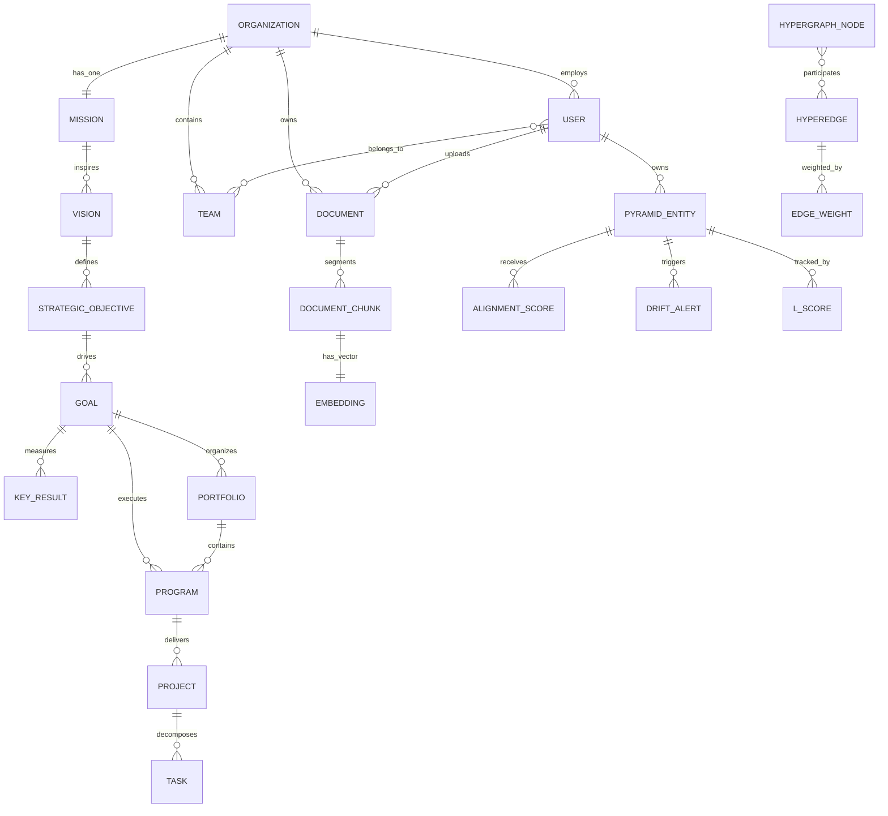

# PKA-STRAT Data Models Specification

## Version: 1.0.0
## Date: 2025-12-28
## Status: Draft

---

## Table of Contents

1. [Overview](#overview)
2. [Entity-Relationship Diagram](#entity-relationship-diagram)
3. [Core Entities](#core-entities)
4. [Pyramid of Clarity Data Structures](#pyramid-of-clarity-data-structures)
5. [Strategic Resonance Scoring Models](#strategic-resonance-scoring-models)
6. [Vector Embeddings Schema](#vector-embeddings-schema)
7. [Audit Trail and Versioning Models](#audit-trail-and-versioning-models)
8. [Redis Cache Structures](#redis-cache-structures)
9. [Sample Data Examples](#sample-data-examples)
10. [Data Flow Diagrams](#data-flow-diagrams)

---

## Overview

This document defines the comprehensive data models for PKA-STRAT, a document-centric strategic alignment platform. The data architecture supports:

- **Hierarchical Strategic Structures**: Pyramid of Clarity from Mission to Tasks
- **Semantic Intelligence**: Vector embeddings for all strategic entities
- **Hypergraph Relationships**: Complex multi-entity relationship modeling
- **Temporal Tracking**: Complete audit trails and historical snapshots
- **Multi-Tenancy**: Organization-level data isolation
- **Real-Time Scoring**: Strategic Resonance Engine metrics

### Design Principles

| Principle | Description |
|-----------|-------------|
| **Entity-First** | Core business entities drive all data modeling decisions |
| **Semantic Rich** | Every entity supports vector embeddings for AI-powered search |
| **Hierarchical Integrity** | Pyramid structure enforced at data layer |
| **Temporal Awareness** | All changes tracked with full audit history |
| **Multi-Tenant Safe** | Organization isolation at every layer |
| **Performance Optimized** | Indexed for read-heavy strategic dashboards |

---

## Entity-Relationship Diagram

### High-Level Domain Model (Mermaid)



### ASCII Entity Relationship Diagram

```
                                    MULTI-TENANT BOUNDARY
    +---------------------------------------------------------------------------+
    |                              ORGANIZATION                                  |
    |  +----+  +------+  +------+  +------+  +---------+  +-------------+       |
    |  |UUID|  | name |  | slug |  |domain|  |settings |  |subscription |       |
    +---------------------------------------------------------------------------+
           |                    |                    |
           |                    |                    |
    +------v------+      +------v------+      +------v------+
    |    USERS    |      |    TEAMS    |      |  DOCUMENTS  |
    |             |      |             |      |             |
    | - id (UUID) |      | - id (UUID) |      | - id (UUID) |
    | - email     |      | - name      |      | - title     |
    | - name      |      | - lead_id   |      | - type      |
    | - role      |      | - parent_id |      | - embedding |
    | - status    |      |             |      | - chunks[]  |
    +-------------+      +-------------+      +-------------+
           |                                        |
           |    PYRAMID OF CLARITY                  |
           |    ==================                  |
           |                                        |
           |    +------------------+                |
           +--->|     MISSION      |<---------------+
                | (1 per org)      |    linked_to
                +--------+---------+
                         |
                         v
                +------------------+
                |     VISION       |
                | (1-3 per mission)|
                +--------+---------+
                         |
                         v
                +-------------------+
                |STRATEGIC_OBJECTIVE|
                | (3-5 year goals)  |
                +--------+----------+
                         |
            +------------+------------+
            |            |            |
            v            v            v
    +-------+----+ +-----+------+ +---+-------+
    |    GOAL    | |  PORTFOLIO | |  PROGRAM  |
    | (OKRs)     | | (themes)   | | (efforts) |
    +-----+------+ +-----+------+ +-----+-----+
          |              |              |
          |              +--------------+
          |                     |
          v                     v
    +-----+------+       +------+-----+
    | KEY_RESULT |       |  PROJECT   |
    | (metrics)  |       | (delivery) |
    +------------+       +-----+------+
                               |
                               v
                        +------+------+
                        |    TASK     |
                        | (actions)   |
                        +-------------+
```

---

## Core Entities

### 1. Organization

The root entity for multi-tenant isolation.

```typescript
interface Organization {
  // Identity
  id: UUID;
  name: string;                    // "Acme Corporation"
  displayName: string;             // "ACME Corp"
  slug: string;                    // "acme-corp" (unique)
  domain: string;                  // "acme.com"

  // Branding
  logoUrl: string | null;
  primaryColor: string | null;     // "#3B82F6"

  // Configuration
  settings: OrganizationSettings;

  // Subscription
  subscriptionTier: 'free' | 'starter' | 'professional' | 'enterprise';
  subscriptionStatus: 'active' | 'trial' | 'suspended' | 'cancelled';

  // Limits
  maxUsers: number;
  maxStorageGb: number;
  maxProjects: number;

  // Contact
  billingEmail: string;
  supportEmail: string | null;

  // Audit
  createdAt: DateTime;
  updatedAt: DateTime;
  deletedAt: DateTime | null;
}

interface OrganizationSettings {
  timezone: string;                // "America/New_York"
  defaultLanguage: string;         // "en-US"
  fiscalYearStart: number;         // Month (1-12)
  alignmentThresholds: {
    high: number;                  // 0.8 (80%)
    medium: number;                // 0.5 (50%)
    critical: number;              // 0.3 (30%)
  };
  notificationPreferences: NotificationConfig;
  integrations: IntegrationConfig[];
}
```

### 2. User

User accounts with organization membership.

```typescript
interface User {
  // Identity
  id: UUID;
  email: string;                   // Unique
  emailVerified: boolean;

  // Profile
  firstName: string;
  lastName: string;
  displayName: string;
  avatarUrl: string | null;

  // Preferences
  timezone: string;
  locale: string;
  preferences: UserPreferences;

  // Security
  passwordHash: string;            // bcrypt/argon2
  twoFactorEnabled: boolean;
  twoFactorSecret: string | null;

  // Session
  lastLoginAt: DateTime | null;
  lastActiveAt: DateTime | null;

  // Status
  status: 'active' | 'inactive' | 'suspended' | 'deleted';

  // Audit
  createdAt: DateTime;
  updatedAt: DateTime;
  deletedAt: DateTime | null;
}

interface UserPreferences {
  theme: 'light' | 'dark' | 'system';
  dashboardLayout: DashboardLayoutConfig;
  notifications: {
    email: boolean;
    inApp: boolean;
    driftAlerts: boolean;
    weeklyDigest: boolean;
  };
  defaultView: 'pyramid' | 'list' | 'kanban';
}
```

### 3. Organization Member

Junction entity for user-organization relationships.

```typescript
interface OrganizationMember {
  id: UUID;
  organizationId: UUID;
  userId: UUID;

  // Role (determines UI/capabilities)
  role: 'owner' | 'admin' | 'leader' | 'manager' | 'member' | 'viewer';

  // Permissions (fine-grained access)
  permissions: Permission[];

  // Status
  status: 'active' | 'invited' | 'suspended' | 'removed';

  // Invitation tracking
  invitedBy: UUID | null;
  invitedAt: DateTime | null;
  joinedAt: DateTime | null;

  // Audit
  createdAt: DateTime;
  updatedAt: DateTime;
}

type Permission =
  | 'read:all'
  | 'write:pyramid'
  | 'write:documents'
  | 'manage:team'
  | 'manage:settings'
  | 'admin:organization'
  | 'delete:entities';
```

### 4. Team

Organizational units within an organization.

```typescript
interface Team {
  id: UUID;
  organizationId: UUID;

  // Details
  name: string;
  description: string | null;

  // Hierarchy
  parentTeamId: UUID | null;       // For nested teams

  // Leadership
  teamLeadId: UUID | null;

  // Settings
  settings: TeamSettings;

  // Audit
  createdAt: DateTime;
  updatedAt: DateTime;
  createdBy: UUID | null;
  deletedAt: DateTime | null;
}

interface TeamSettings {
  defaultProjectOwner: UUID | null;
  alignmentNotifications: boolean;
  weeklyReportDay: number;         // 0-6 (Sunday-Saturday)
}
```

---

## Pyramid of Clarity Data Structures

### Base Pyramid Entity

All pyramid levels inherit from this base structure.

```typescript
interface PyramidEntity {
  // Identity
  id: UUID;
  organizationId: UUID;

  // Type discriminator (STI pattern)
  entityType: PyramidLevel;

  // Hierarchy
  parentId: UUID | null;
  path: string;                    // LTree path: "mission.vision_1.objective_2"

  // Content
  title: string;
  description: string | null;

  // Ownership
  ownerId: UUID | null;
  teamId: UUID | null;

  // Status
  status: EntityStatus;

  // Temporal
  startDate: Date | null;
  targetDate: Date | null;
  completedDate: Date | null;

  // Semantic
  embedding: Float32Array | null;  // 1536-dimensional vector

  // Metadata
  metadata: Record<string, any>;

  // Audit
  createdAt: DateTime;
  updatedAt: DateTime;
  createdBy: UUID | null;
  updatedBy: UUID | null;
  deletedAt: DateTime | null;
  deletedBy: UUID | null;
  version: number;
}

type PyramidLevel =
  | 'mission'
  | 'vision'
  | 'strategic_objective'
  | 'goal'
  | 'portfolio'
  | 'program'
  | 'project'
  | 'task';

type EntityStatus =
  | 'draft'
  | 'proposed'
  | 'active'
  | 'on_hold'
  | 'completed'
  | 'cancelled'
  | 'archived';
```

### Mission Entity

```typescript
interface Mission extends PyramidEntity {
  entityType: 'mission';

  // Mission-specific
  purpose: string;                 // Core purpose statement
  coreValues: string[];            // ["Innovation", "Integrity", "Excellence"]
  horizonYears: number;            // Strategic horizon (typically 10)
  baselineAlignmentScore: number;  // Initial baseline (0-100)
}
```

### Vision Entity

```typescript
interface Vision extends PyramidEntity {
  entityType: 'vision';

  // Vision-specific
  visionStatement: string;
  successCriteria: string[];
  targetYear: number;              // e.g., 2028
  missionId: UUID;                 // Reference to parent mission

  // Market context
  marketConditions: string | null;
  competitivePosition: string | null;
}
```

### Strategic Objective Entity

```typescript
interface StrategicObjective extends PyramidEntity {
  entityType: 'strategic_objective';

  // Objective-specific
  objectiveStatement: string;
  successMetrics: SuccessMetric[];
  planningHorizon: number;         // Years (1-10)
  strategicPriority: 'critical' | 'high' | 'medium' | 'low';
  visionId: UUID;

  // Resource allocation
  budgetAllocated: number | null;
  budgetCurrency: string;          // "USD"
}

interface SuccessMetric {
  metric: string;                  // "Market Share"
  target: string;                  // "25%"
  unit: string;                    // "percentage"
  currentValue: string | null;
}
```

### Goal Entity (OKRs)

```typescript
interface Goal extends PyramidEntity {
  entityType: 'goal';

  // OKR framework
  objectiveText: string;
  strategicObjectiveId: UUID | null;

  // Temporal scope
  quarter: 1 | 2 | 3 | 4 | null;
  fiscalYear: number;

  // Progress
  progressPercentage: number;      // 0-100
  confidenceLevel: number | null;  // 0-100
  riskLevel: 'low' | 'medium' | 'high' | 'critical' | null;
}

interface KeyResult {
  id: UUID;
  goalId: UUID;

  // Key result details
  description: string;
  metricName: string;
  unit: string | null;

  // Values
  baselineValue: number | null;
  targetValue: number;
  currentValue: number | null;

  // Progress
  progressPercentage: number;      // 0-100

  // Audit
  createdAt: DateTime;
  updatedAt: DateTime;
}
```

### Portfolio Entity

```typescript
interface Portfolio extends PyramidEntity {
  entityType: 'portfolio';

  // Portfolio-specific
  strategicTheme: string;
  investmentThesis: string | null;
  primaryGoalId: UUID | null;

  // Financial tracking
  totalBudget: number | null;
  allocatedBudget: number;
  spentToDate: number;
  currency: string;

  // Performance
  roiTarget: number | null;        // Expected ROI %
  roiActual: number | null;        // Actual ROI %
}
```

### Program Entity

```typescript
interface Program extends PyramidEntity {
  entityType: 'program';

  // Program-specific
  programCharter: string | null;
  successCriteria: SuccessCriterion[];
  programManagerId: UUID | null;
  governanceModel: string | null;

  // Relationships
  portfolioId: UUID | null;
  goalId: UUID | null;

  // Financial
  budget: number | null;
  currency: string;

  // Dependencies
  dependencies: Dependency[];

  // Health
  healthStatus: 'green' | 'yellow' | 'red' | 'unknown';
}

interface Dependency {
  type: 'blocks' | 'blocked_by' | 'relates_to';
  entityId: UUID;
  description: string;
}
```

### Project Entity

```typescript
interface Project extends PyramidEntity {
  entityType: 'project';

  // Project-specific
  projectCharter: string | null;
  deliverables: Deliverable[];
  projectManagerId: UUID | null;
  methodology: 'agile' | 'waterfall' | 'hybrid' | 'kanban' | null;

  // Relationships
  programId: UUID | null;
  goalId: UUID | null;
  portfolioId: UUID | null;

  // Financial
  budget: number | null;
  actualCost: number;
  currency: string;

  // Progress
  completionPercentage: number;    // 0-100

  // Risk tracking
  risks: Risk[];
  issues: Issue[];
  blockers: Blocker[];
}

interface Deliverable {
  name: string;
  dueDate: Date;
  status: 'not_started' | 'in_progress' | 'completed' | 'blocked';
  assigneeId: UUID | null;
}

interface Risk {
  id: string;
  description: string;
  probability: 'low' | 'medium' | 'high';
  impact: 'low' | 'medium' | 'high';
  mitigation: string | null;
  status: 'identified' | 'mitigating' | 'resolved' | 'occurred';
}
```

### Task Entity

```typescript
interface Task extends PyramidEntity {
  entityType: 'task';

  // Task-specific
  taskType: 'feature' | 'bug' | 'enhancement' | 'research' |
            'documentation' | 'testing' | 'other';

  // Assignment
  assigneeId: UUID | null;
  projectId: UUID;

  // Priority
  priority: 'critical' | 'high' | 'medium' | 'low';

  // Effort
  estimatedHours: number | null;
  actualHours: number | null;
  storyPoints: number | null;

  // Sprint/iteration
  sprintId: UUID | null;

  // Dependencies
  blockedBy: UUID[];               // Array of task IDs

  // Completion
  completedPercentage: number;     // 0-100
}
```

### Pyramid Hierarchy Closure Table

For efficient ancestor/descendant queries.

```typescript
interface PyramidHierarchyClosure {
  ancestorId: UUID;
  descendantId: UUID;
  depth: number;                   // 0 = self, 1 = direct child, etc.
}
```

---

## Strategic Resonance Scoring Models

### Alignment Score

Real-time alignment tracking for all pyramid entities.

```typescript
interface AlignmentScore {
  id: UUID;
  organizationId: UUID;

  // Entity being scored
  entityType: PyramidLevel;
  entityId: UUID;

  // Core alignment metrics (0-100)
  missionAlignmentScore: number;
  visionAlignmentScore: number | null;
  objectiveAlignmentScore: number | null;
  overallAlignmentScore: number;

  // Alignment dimensions (0-100)
  strategicFit: number | null;
  resourceAlignment: number | null;
  outcomeAlignment: number | null;
  culturalAlignment: number | null;

  // Computation metadata
  computationMethod: string;       // "semantic_similarity_v2"
  computationParams: ComputationParams;
  confidence: number;              // 0-1

  // Contributing factors
  factors: AlignmentFactor[];

  // Temporal
  scoreDate: DateTime;
  validUntil: DateTime | null;

  // Audit
  computedBy: 'system' | 'user' | 'ml_model';
  createdAt: DateTime;
}

interface AlignmentFactor {
  factor: string;                  // "Document Semantic Match"
  weight: number;                  // 0.3
  score: number;                   // 85
  source: string;                  // "strategic_plan_2025.pdf"
}

interface ComputationParams {
  embeddingModel: string;
  similarityThreshold: number;
  hierarchyWeight: number;
  documentWeight: number;
  temporalDecay: number;
}
```

### Mission Drift Alert

Automated alerts for alignment degradation.

```typescript
interface DriftAlert {
  id: UUID;
  organizationId: UUID;

  // Affected entity
  entityType: PyramidLevel;
  entityId: UUID;

  // Alert details
  alertType: DriftAlertType;
  severity: 'low' | 'medium' | 'high' | 'critical';

  // Drift metrics
  previousScore: number;
  currentScore: number;
  scoreChange: number;             // Negative = drift
  thresholdValue: number;

  // Alert content
  title: string;
  description: string;
  recommendations: DriftRecommendation[];

  // Status
  status: 'active' | 'acknowledged' | 'investigating' | 'resolved' | 'dismissed';

  // Assignment
  assignedTo: UUID | null;
  assignedAt: DateTime | null;

  // Resolution
  resolvedAt: DateTime | null;
  resolvedBy: UUID | null;
  resolutionNotes: string | null;

  // Temporal
  detectedAt: DateTime;
  createdAt: DateTime;
  updatedAt: DateTime;
}

type DriftAlertType =
  | 'alignment_drop'
  | 'threshold_breach'
  | 'trend_negative'
  | 'anomaly_detected'
  | 'dependency_conflict';

interface DriftRecommendation {
  action: string;
  priority: 'high' | 'medium' | 'low';
  rationale: string;
  estimatedEffort: string;
}
```

### L-Score (Provenance Score)

Provenance and lineage tracking metrics.

```typescript
interface LScore {
  id: UUID;
  organizationId: UUID;

  // Entity being scored
  entityType: PyramidLevel;
  entityId: UUID;

  // L-Score components (0-100)
  lineageClarity: number;          // How clear is the path to mission?
  sourceCredibility: number;       // How trustworthy are source documents?
  traceability: number;            // Can decisions be traced to sources?
  lScore: number;                  // Overall L-Score

  // Provenance chain
  provenanceChain: ProvenanceLink[];
  provenanceDepth: number;

  // Source documents
  sourceDocumentIds: UUID[];

  // Computation
  computationMethod: string;
  confidence: number;              // 0-1

  // Temporal
  scoreDate: DateTime;
  validUntil: DateTime | null;
  createdAt: DateTime;
}

interface ProvenanceLink {
  sourceEntityType: PyramidLevel | 'document';
  sourceEntityId: UUID;
  relationship: string;            // "derives_from", "supports", "evidences"
  confidence: number;              // 0-1
  sourceChunk: string | null;      // Specific text snippet
}
```

### Alignment History Snapshot

Temporal tracking of organizational alignment.

```typescript
interface AlignmentHistorySnapshot {
  id: UUID;
  organizationId: UUID;

  // Snapshot metadata
  snapshotDate: DateTime;
  snapshotType: 'daily' | 'weekly' | 'monthly' | 'quarterly' | 'annual' |
                'on_demand' | 'milestone';

  // Mission-level metrics
  missionId: UUID;
  overallMissionAlignment: number;

  // Aggregated metrics
  totalEntitiesTracked: number;
  entitiesAligned: number;         // Score >= 70
  entitiesMisaligned: number;      // Score < 70
  entitiesCritical: number;        // Score < 50

  // Average scores by level
  avgVisionAlignment: number | null;
  avgObjectiveAlignment: number | null;
  avgGoalAlignment: number | null;
  avgProjectAlignment: number | null;

  // Trend
  alignmentTrend: 'improving' | 'stable' | 'declining' | 'volatile';

  // Full snapshot data (for point-in-time analysis)
  snapshotData: SnapshotData;

  // Computation metadata
  computedAt: DateTime;
  computationDurationMs: number;
  createdBy: string;               // "system", "scheduled_job", user_id
  createdAt: DateTime;
}

interface SnapshotData {
  entities: EntitySnapshot[];
  alignmentScores: AlignmentScoreSnapshot[];
  documentStats: DocumentStats;
}
```

---

## Vector Embeddings Schema

### Embedding Configuration

```typescript
interface EmbeddingConfig {
  model: string;                   // "text-embedding-ada-002", "text-embedding-3-small"
  dimensions: number;              // 1536, 3072
  distanceMetric: 'cosine' | 'euclidean' | 'inner_product';
  indexType: 'ivfflat' | 'hnsw';
  indexParams: IndexParams;
}

interface IndexParams {
  // IVFFlat
  lists?: number;                  // 100-1000 based on data size

  // HNSW
  m?: number;                      // 16 (connections per layer)
  efConstruction?: number;         // 64 (build-time accuracy)
  efSearch?: number;               // 40 (search-time accuracy)
}
```

### Document Embedding

```typescript
interface DocumentEmbedding {
  id: UUID;

  // Reference (one of these must be set)
  documentId: UUID | null;
  chunkId: UUID | null;

  // Embedding details
  embeddingModel: string;
  embeddingDimension: number;
  embedding: Float32Array;

  // Metadata
  tokenCount: number;
  embeddingCost: number | null;    // USD
  embeddingQualityScore: number | null;  // 0-1

  // Temporal
  createdAt: DateTime;
}
```

### Semantic Search Query

```typescript
interface SemanticSearchQuery {
  // Query embedding
  queryEmbedding: Float32Array;

  // Filters
  organizationId: UUID;
  entityTypes?: PyramidLevel[];
  documentTypes?: DocumentType[];
  dateRange?: {
    start: Date;
    end: Date;
  };

  // Search parameters
  limit: number;                   // Max results
  threshold: number;               // Minimum similarity (0-1)
  includeMetadata: boolean;

  // Hybrid search
  textQuery?: string;              // For hybrid search
  textWeight?: number;             // 0-1, balance between semantic and text
}

interface SemanticSearchResult {
  entityType: PyramidLevel | 'document' | 'chunk';
  entityId: UUID;
  similarityScore: number;         // 0-1
  content: string;
  metadata: Record<string, any>;
  highlights?: string[];
}
```

### Hypergraph Node

```typescript
interface HypergraphNode {
  id: UUID;
  organizationId: UUID;

  // Node identity
  nodeType: string;                // "pyramid_entity", "document", "user", "concept"
  entityId: UUID;

  // Attributes
  label: string;
  properties: Record<string, any>;

  // Vector representation
  embedding: Float32Array | null;

  // Centrality metrics (computed)
  degreeCentrality: number | null;
  betweennessCentrality: number | null;
  eigenvectorCentrality: number | null;
  pagerank: number | null;

  // Temporal
  createdAt: DateTime;
  updatedAt: DateTime;
}
```

### Hyperedge

```typescript
interface Hyperedge {
  id: UUID;
  organizationId: UUID;

  // Edge type/relationship
  edgeType: string;                // "supports", "contributes_to", "conflicts_with"
  relationshipLabel: string;
  description: string | null;

  // Directionality
  isDirected: boolean;

  // Properties
  properties: Record<string, any>;

  // Temporal validity
  validFrom: DateTime;
  validTo: DateTime | null;

  // Confidence
  confidence: number;              // 0-1

  // Source
  derivedFrom: 'manual' | 'document_analysis' | 'ml_inference';

  // Audit
  createdAt: DateTime;
  updatedAt: DateTime;
  createdBy: UUID | null;
}

interface HyperedgeMember {
  hyperedgeId: UUID;
  nodeId: UUID;

  // Member role in the hyperedge
  role: 'source' | 'target' | 'context' | 'contributor' | null;

  // Weight/importance
  weight: number;                  // Default 1.0

  // Order (for directed hyperedges)
  sequenceOrder: number | null;

  createdAt: DateTime;
}

interface EdgeWeight {
  id: UUID;
  hyperedgeId: UUID;

  // Weight type
  weightType: 'alignment_score' | 'semantic_similarity' | 'temporal_correlation' |
              'causal_strength' | 'dependency_strength' | 'custom';

  // Weight value
  weightValue: number;

  // Normalization
  isNormalized: boolean;
  normalizationMethod: string | null;

  // Computation
  computationMethod: string;
  computationParams: Record<string, any>;

  // Temporal
  computedAt: DateTime;
  validUntil: DateTime | null;

  // Confidence
  confidence: number | null;       // 0-1
}
```

---

## Audit Trail and Versioning Models

### Change Log Entry

```typescript
interface ChangeLogEntry {
  id: UUID;
  organizationId: UUID;

  // Change target
  tableName: string;
  recordId: UUID;

  // Operation
  operation: 'INSERT' | 'UPDATE' | 'DELETE';

  // Change details
  oldValues: Record<string, any> | null;
  newValues: Record<string, any> | null;
  changedFields: string[];

  // Context
  userId: UUID | null;
  ipAddress: string | null;
  userAgent: string | null;
  sessionId: string | null;

  // Correlation
  requestId: string | null;        // For tracing across services
  parentChangeId: UUID | null;     // For cascading changes

  // Temporal
  changedAt: DateTime;
}
```

### Entity Version History

```typescript
interface EntityVersion {
  id: UUID;
  entityType: string;
  entityId: UUID;

  // Version metadata
  versionNumber: number;
  versionLabel: string | null;     // "v1.0", "Q2 Update"

  // State snapshot
  entityState: Record<string, any>;

  // Change summary
  changeSummary: string | null;
  changedFields: string[];

  // Authorship
  changedBy: UUID;
  changeReason: string | null;

  // Validity period
  validFrom: DateTime;
  validTo: DateTime | null;        // null = current version

  createdAt: DateTime;
}
```

### Audit Event

```typescript
interface AuditEvent {
  id: UUID;
  organizationId: UUID;

  // Event classification
  eventType: AuditEventType;
  eventCategory: 'authentication' | 'authorization' | 'data_access' |
                 'data_modification' | 'system' | 'integration';

  // Actor
  actorType: 'user' | 'system' | 'api_key' | 'integration';
  actorId: string;
  actorName: string;

  // Resource
  resourceType: string;
  resourceId: string | null;
  resourceName: string | null;

  // Action
  action: string;
  actionResult: 'success' | 'failure' | 'partial';

  // Details
  details: Record<string, any>;
  errorMessage: string | null;

  // Context
  ipAddress: string;
  userAgent: string | null;
  sessionId: string | null;
  requestId: string;

  // Temporal
  occurredAt: DateTime;
  processedAt: DateTime;
}

type AuditEventType =
  | 'login'
  | 'logout'
  | 'permission_granted'
  | 'permission_denied'
  | 'entity_created'
  | 'entity_updated'
  | 'entity_deleted'
  | 'document_uploaded'
  | 'alignment_computed'
  | 'alert_generated'
  | 'export_requested'
  | 'api_key_created'
  | 'api_key_revoked';
```

---

## Redis Cache Structures

### Session Cache

```typescript
// Key: session:{sessionId}
// TTL: 24 hours
interface SessionCache {
  userId: UUID;
  organizationId: UUID;
  role: string;
  permissions: string[];
  createdAt: number;               // Unix timestamp
  lastActivity: number;
  metadata: Record<string, any>;
}
```

### User Context Cache

```typescript
// Key: user_context:{userId}:{organizationId}
// TTL: 1 hour
interface UserContextCache {
  preferences: UserPreferences;
  recentEntities: RecentEntity[];
  dashboardConfig: DashboardConfig;
  notifications: {
    unreadCount: number;
    lastChecked: number;
  };
}

interface RecentEntity {
  entityType: PyramidLevel;
  entityId: UUID;
  title: string;
  accessedAt: number;
}
```

### Alignment Score Cache

```typescript
// Key: alignment:{organizationId}:{entityType}:{entityId}
// TTL: 5 minutes
interface AlignmentScoreCache {
  overallScore: number;
  missionScore: number;
  visionScore: number | null;
  objectiveScore: number | null;
  trend: 'improving' | 'stable' | 'declining';
  computedAt: number;
  expiresAt: number;
}

// Key: alignment:summary:{organizationId}
// TTL: 15 minutes
interface AlignmentSummaryCache {
  totalEntities: number;
  alignedCount: number;
  misalignedCount: number;
  criticalCount: number;
  averageScore: number;
  byLevel: Record<PyramidLevel, LevelSummary>;
  computedAt: number;
}

interface LevelSummary {
  count: number;
  averageScore: number;
  alignedCount: number;
  criticalCount: number;
}
```

### Pyramid Hierarchy Cache

```typescript
// Key: pyramid:{organizationId}
// TTL: 10 minutes
interface PyramidHierarchyCache {
  mission: MissionNode;
  lastUpdated: number;
}

interface MissionNode {
  id: UUID;
  title: string;
  alignmentScore: number;
  visions: VisionNode[];
}

interface VisionNode {
  id: UUID;
  title: string;
  alignmentScore: number;
  objectives: ObjectiveNode[];
}

// ... continues for full hierarchy
```

### Document Processing Queue

```typescript
// Key: doc_queue:{organizationId}
// Type: Redis List (LPUSH/RPOP)
interface DocumentQueueItem {
  documentId: UUID;
  operation: 'process' | 'reprocess' | 'delete';
  priority: 'high' | 'normal' | 'low';
  retryCount: number;
  queuedAt: number;
  queuedBy: UUID;
}

// Key: doc_processing:{documentId}
// TTL: 1 hour
interface DocumentProcessingStatus {
  status: 'queued' | 'processing' | 'chunking' | 'embedding' |
          'indexing' | 'completed' | 'failed';
  progress: number;                // 0-100
  startedAt: number | null;
  completedAt: number | null;
  error: string | null;
  chunks: number;
  embeddings: number;
}
```

### Rate Limiting

```typescript
// Key: rate:{identifier}:{window}
// TTL: matches window duration
interface RateLimitCounter {
  count: number;
  windowStart: number;
}

// Key: rate_config:{endpoint}
interface RateLimitConfig {
  limit: number;
  windowSeconds: number;
  burstLimit: number;
}
```

### Real-Time Subscriptions

```typescript
// Key: ws:connections:{organizationId}
// Type: Redis Set
// Members: connectionId strings

// Key: ws:subscriptions:{connectionId}
// Type: Redis Set
// Members: channel names

// Channel names:
// - alignment:{organizationId}
// - drift:{organizationId}
// - document:{organizationId}:{documentId}
// - pyramid:{organizationId}

// Pub/Sub message format
interface WebSocketMessage {
  type: 'alignment_update' | 'drift_alert' | 'document_processed' |
        'entity_changed' | 'notification';
  timestamp: number;
  organizationId: UUID;
  data: Record<string, any>;
}
```

---

## Sample Data Examples

### Organization Sample

```json
{
  "id": "org-123e4567-e89b-12d3-a456-426614174000",
  "name": "TechCorp Industries",
  "displayName": "TechCorp",
  "slug": "techcorp",
  "domain": "techcorp.com",
  "logoUrl": "https://cdn.pka-strat.com/logos/techcorp.png",
  "primaryColor": "#2563EB",
  "settings": {
    "timezone": "America/New_York",
    "defaultLanguage": "en-US",
    "fiscalYearStart": 1,
    "alignmentThresholds": {
      "high": 0.8,
      "medium": 0.5,
      "critical": 0.3
    }
  },
  "subscriptionTier": "professional",
  "subscriptionStatus": "active",
  "maxUsers": 100,
  "maxStorageGb": 100,
  "maxProjects": 500,
  "createdAt": "2024-01-15T09:00:00Z",
  "updatedAt": "2025-01-10T14:30:00Z"
}
```

### Mission Sample

```json
{
  "id": "mission-789e4567-e89b-12d3-a456-426614174000",
  "organizationId": "org-123e4567-e89b-12d3-a456-426614174000",
  "entityType": "mission",
  "parentId": null,
  "path": "mission_techcorp",
  "title": "Empower businesses through intelligent automation",
  "description": "We exist to transform how businesses operate by providing cutting-edge AI-powered automation solutions that increase efficiency, reduce costs, and enable human workers to focus on high-value creative work.",
  "status": "active",
  "embedding": [0.0234, -0.0156, 0.0891, ...],
  "purpose": "To make intelligent automation accessible to every business, regardless of size",
  "coreValues": [
    "Innovation First",
    "Customer Success",
    "Ethical AI",
    "Continuous Learning",
    "Collaborative Excellence"
  ],
  "horizonYears": 10,
  "baselineAlignmentScore": 75.5,
  "createdAt": "2024-01-15T09:30:00Z",
  "updatedAt": "2025-01-05T10:15:00Z",
  "version": 3
}
```

### Strategic Objective Sample

```json
{
  "id": "obj-456e4567-e89b-12d3-a456-426614174000",
  "organizationId": "org-123e4567-e89b-12d3-a456-426614174000",
  "entityType": "strategic_objective",
  "parentId": "vision-321e4567-e89b-12d3-a456-426614174000",
  "path": "mission_techcorp.vision_market_leader.obj_enterprise_expansion",
  "title": "Expand Enterprise Market Share to 25% by 2027",
  "description": "Capture significant enterprise market share through product innovation, strategic partnerships, and targeted sales expansion.",
  "status": "active",
  "ownerId": "user-ceo-uuid",
  "teamId": "team-executive-uuid",
  "startDate": "2025-01-01",
  "targetDate": "2027-12-31",
  "objectiveStatement": "Achieve 25% market share in the enterprise automation segment through product excellence and strategic partnerships",
  "successMetrics": [
    {
      "metric": "Market Share",
      "target": "25%",
      "unit": "percentage",
      "currentValue": "12%"
    },
    {
      "metric": "Enterprise Customers",
      "target": "500",
      "unit": "count",
      "currentValue": "187"
    },
    {
      "metric": "Annual Recurring Revenue",
      "target": "$100M",
      "unit": "USD",
      "currentValue": "$42M"
    }
  ],
  "planningHorizon": 3,
  "strategicPriority": "critical",
  "visionId": "vision-321e4567-e89b-12d3-a456-426614174000",
  "budgetAllocated": 15000000,
  "budgetCurrency": "USD",
  "embedding": [0.0189, -0.0234, 0.0567, ...],
  "createdAt": "2024-06-01T11:00:00Z",
  "updatedAt": "2025-01-12T09:45:00Z",
  "version": 5
}
```

### Alignment Score Sample

```json
{
  "id": "align-999e4567-e89b-12d3-a456-426614174000",
  "organizationId": "org-123e4567-e89b-12d3-a456-426614174000",
  "entityType": "project",
  "entityId": "proj-555e4567-e89b-12d3-a456-426614174000",
  "missionAlignmentScore": 82.5,
  "visionAlignmentScore": 85.2,
  "objectiveAlignmentScore": 78.9,
  "overallAlignmentScore": 81.3,
  "strategicFit": 84.0,
  "resourceAlignment": 76.5,
  "outcomeAlignment": 80.2,
  "culturalAlignment": 83.8,
  "computationMethod": "semantic_similarity_v2",
  "computationParams": {
    "embeddingModel": "text-embedding-ada-002",
    "similarityThreshold": 0.6,
    "hierarchyWeight": 0.4,
    "documentWeight": 0.3,
    "temporalDecay": 0.1
  },
  "confidence": 0.89,
  "factors": [
    {
      "factor": "Mission Statement Alignment",
      "weight": 0.35,
      "score": 84,
      "source": "mission_techcorp"
    },
    {
      "factor": "Supporting Document Evidence",
      "weight": 0.25,
      "score": 81,
      "source": "project_charter_v2.pdf"
    },
    {
      "factor": "Hierarchy Chain Coherence",
      "weight": 0.25,
      "score": 79,
      "source": "pyramid_path_analysis"
    },
    {
      "factor": "Outcome Metrics Alignment",
      "weight": 0.15,
      "score": 78,
      "source": "okr_mapping"
    }
  ],
  "scoreDate": "2025-01-12T06:00:00Z",
  "validUntil": "2025-01-13T06:00:00Z",
  "computedBy": "system",
  "createdAt": "2025-01-12T06:00:15Z"
}
```

### Drift Alert Sample

```json
{
  "id": "alert-777e4567-e89b-12d3-a456-426614174000",
  "organizationId": "org-123e4567-e89b-12d3-a456-426614174000",
  "entityType": "project",
  "entityId": "proj-888e4567-e89b-12d3-a456-426614174000",
  "alertType": "alignment_drop",
  "severity": "high",
  "previousScore": 78.5,
  "currentScore": 62.3,
  "scoreChange": -16.2,
  "thresholdValue": 70.0,
  "title": "Significant alignment drop detected for 'Customer Portal Redesign'",
  "description": "The project's alignment with strategic objectives has dropped below the acceptable threshold. Recent scope changes have moved the project away from the original strategic intent.",
  "recommendations": [
    {
      "action": "Review recent scope changes with project sponsor",
      "priority": "high",
      "rationale": "Scope changes on 2025-01-08 appear to have introduced non-strategic features",
      "estimatedEffort": "2 hours"
    },
    {
      "action": "Re-validate project charter against Q1 OKRs",
      "priority": "high",
      "rationale": "Ensure project deliverables still map to current quarter objectives",
      "estimatedEffort": "1 hour"
    },
    {
      "action": "Schedule alignment workshop with stakeholders",
      "priority": "medium",
      "rationale": "Realign team understanding of strategic context",
      "estimatedEffort": "4 hours"
    }
  ],
  "status": "active",
  "assignedTo": null,
  "detectedAt": "2025-01-12T06:15:00Z",
  "createdAt": "2025-01-12T06:15:05Z",
  "updatedAt": "2025-01-12T06:15:05Z"
}
```

### Document with Chunks Sample

```json
{
  "document": {
    "id": "doc-111e4567-e89b-12d3-a456-426614174000",
    "organizationId": "org-123e4567-e89b-12d3-a456-426614174000",
    "title": "Q1 2025 Strategic Plan",
    "description": "Comprehensive strategic plan outlining Q1 priorities and resource allocation",
    "fileName": "Q1_2025_Strategic_Plan.pdf",
    "fileType": "application/pdf",
    "fileSizeBytes": 2457600,
    "filePath": "s3://pka-docs/org-123/2025/Q1_2025_Strategic_Plan.pdf",
    "fileHash": "a7f8b2c3d4e5f6g7h8i9j0k1l2m3n4o5p6q7r8s9t0u1v2w3",
    "docType": "strategic_plan",
    "classificationLevel": "confidential",
    "authorId": "user-ceo-uuid",
    "linkedEntityType": "strategic_objective",
    "linkedEntityId": "obj-456e4567-e89b-12d3-a456-426614174000",
    "processingStatus": "indexed",
    "embedding": [0.0123, -0.0456, 0.0789, ...],
    "documentDate": "2024-12-15",
    "uploadedAt": "2024-12-20T14:30:00Z",
    "indexedAt": "2024-12-20T14:45:00Z",
    "createdAt": "2024-12-20T14:30:00Z",
    "version": 1
  },
  "chunks": [
    {
      "id": "chunk-aaa-001",
      "documentId": "doc-111e4567-e89b-12d3-a456-426614174000",
      "chunkIndex": 0,
      "chunkType": "heading",
      "content": "Executive Summary: Q1 2025 Strategic Priorities",
      "contentLength": 49,
      "startPage": 1,
      "endPage": 1,
      "sectionTitle": "Executive Summary",
      "embedding": [0.0234, -0.0567, 0.0891, ...],
      "entities": [
        {"type": "DATE", "value": "Q1 2025", "confidence": 0.98}
      ],
      "keywords": ["executive", "summary", "strategic", "priorities", "Q1"]
    },
    {
      "id": "chunk-aaa-002",
      "documentId": "doc-111e4567-e89b-12d3-a456-426614174000",
      "chunkIndex": 1,
      "chunkType": "paragraph",
      "content": "This quarter, our primary focus is expanding enterprise market presence through three key initiatives: product platform enhancement, strategic partnership development, and sales team expansion. These initiatives directly support our 2027 objective of achieving 25% market share.",
      "contentLength": 312,
      "startPage": 1,
      "endPage": 1,
      "sectionTitle": "Executive Summary",
      "parentSectionTitle": null,
      "contextBefore": "Executive Summary: Q1 2025 Strategic Priorities",
      "embedding": [0.0345, -0.0678, 0.0912, ...],
      "entities": [
        {"type": "DATE", "value": "2027", "confidence": 0.95},
        {"type": "PERCENTAGE", "value": "25%", "confidence": 0.99}
      ],
      "keywords": ["enterprise", "market", "initiatives", "product", "partnership", "sales"]
    }
  ]
}
```

---

## Data Flow Diagrams

### Document Ingestion Flow

```
                                    Document Upload
                                          |
                                          v
    +------------------+           +------------------+
    |   API Gateway    |---------->|  Document Store  |
    |   (Validation)   |           |  (Local Storage) |
    +------------------+           +------------------+
                                          |
                                          v
                               +--------------------+
                               | Processing Queue   |
                               | (Redis)            |
                               +--------------------+
                                          |
                                          v
    +------------------+           +------------------+
    |  Text Extractor  |<----------|   Job Worker     |
    |  (PDF/DOCX/etc)  |           |   (Background)   |
    +------------------+           +------------------+
            |                              |
            v                              |
    +------------------+                   |
    | Semantic Chunker |                   |
    | (Paragraphs/     |                   |
    |  Sections)       |                   |
    +------------------+                   |
            |                              |
            v                              |
    +------------------+           +------------------+
    | Embedding Service|---------->| Vector Database  |
    | (OpenAI/Custom)  |           | (RuVector)       |
    +------------------+           +------------------+
            |                              |
            v                              v
    +------------------+           +------------------+
    | Entity Extraction|           | Hypergraph       |
    | (NER/Concepts)   |           | Construction     |
    +------------------+           +------------------+
            |                              |
            +------------------------------+
                         |
                         v
              +--------------------+
              | Alignment Scoring  |
              | (Async)            |
              +--------------------+
                         |
                         v
              +--------------------+
              | Notification/      |
              | WebSocket Push     |
              +--------------------+
```

### Alignment Computation Flow

```
    Trigger (Schedule/Event/Manual)
                    |
                    v
    +------------------------------+
    |   Alignment Job Scheduler    |
    +------------------------------+
                    |
        +-----------+-----------+
        |           |           |
        v           v           v
    +-------+   +-------+   +-------+
    | Fetch |   | Fetch |   | Fetch |
    | Entity|   | Docs  |   |Hierarch|
    | Data  |   |       |   | y     |
    +-------+   +-------+   +-------+
        |           |           |
        +-----------+-----------+
                    |
                    v
    +------------------------------+
    |   Embedding Similarity       |
    |   Computation                |
    |   - Mission vector           |
    |   - Vision vectors           |
    |   - Document vectors         |
    +------------------------------+
                    |
                    v
    +------------------------------+
    |   Hierarchy Chain Analysis   |
    |   - Path coherence           |
    |   - Depth weighting          |
    |   - Cross-level alignment    |
    +------------------------------+
                    |
                    v
    +------------------------------+
    |   Score Aggregation          |
    |   - Weighted factors         |
    |   - Confidence calculation   |
    |   - Trend computation        |
    +------------------------------+
                    |
        +-----------+-----------+
        |           |           |
        v           v           v
    +-------+   +-------+   +-------+
    | Store |   | Update|   | Check |
    | Score |   | Cache |   | Drift |
    +-------+   +-------+   +-------+
        |           |           |
        |           |           v
        |           |   +---------------+
        |           |   | Generate Alert|
        |           |   | (if threshold |
        |           |   |  breached)    |
        |           |   +---------------+
        |           |           |
        +-----------+-----------+
                    |
                    v
    +------------------------------+
    |   Push Real-Time Updates     |
    |   (WebSocket)                |
    +------------------------------+
```

### User Dashboard Data Flow

```
    User Request (Dashboard Load)
                    |
                    v
    +------------------------------+
    |   API Gateway                |
    |   - Auth validation          |
    |   - Rate limiting            |
    +------------------------------+
                    |
                    v
    +------------------------------+
    |   Cache Layer (Redis)        |
    |   - Check user context       |
    |   - Check alignment summary  |
    |   - Check pyramid cache      |
    +------------------------------+
            |             |
    [Cache Hit]     [Cache Miss]
            |             |
            v             v
    +----------+   +------------------------------+
    | Return   |   |   Database Queries           |
    | Cached   |   |   - Pyramid hierarchy        |
    | Data     |   |   - Recent alignment scores  |
    +----------+   |   - Active drift alerts      |
                   |   - User assignments         |
                   +------------------------------+
                              |
                              v
                   +------------------------------+
                   |   Aggregation Service        |
                   |   - Combine data sources     |
                   |   - Compute summaries        |
                   |   - Format for role          |
                   +------------------------------+
                              |
                              v
                   +------------------------------+
                   |   Cache Update               |
                   |   - Store aggregated data    |
                   |   - Set TTL                  |
                   +------------------------------+
                              |
                              v
                   +------------------------------+
                   |   Response to Client         |
                   |   (JSON)                     |
                   +------------------------------+
```

---

## Appendix: Type Definitions Reference

### Common Types

```typescript
type UUID = string;                // UUID v4 format
type DateTime = string;            // ISO 8601 format
type Date = string;                // YYYY-MM-DD format

interface PaginationParams {
  page: number;
  limit: number;
  sortBy?: string;
  sortOrder?: 'asc' | 'desc';
}

interface PaginatedResponse<T> {
  data: T[];
  pagination: {
    page: number;
    limit: number;
    total: number;
    totalPages: number;
    hasNext: boolean;
    hasPrevious: boolean;
  };
}

interface ApiError {
  error: {
    code: string;
    message: string;
    details?: Record<string, any>;
    timestamp: DateTime;
  };
}
```

### Document Types

```typescript
type DocumentType =
  | 'strategic_plan'
  | 'execution_report'
  | 'market_analysis'
  | 'financial_report'
  | 'project_charter'
  | 'meeting_notes'
  | 'research'
  | 'policy'
  | 'contract'
  | 'other';

type DocumentClassification =
  | 'public'
  | 'internal'
  | 'confidential'
  | 'restricted';

type ProcessingStatus =
  | 'pending'
  | 'processing'
  | 'indexed'
  | 'failed'
  | 'archived';
```

---

## Version History

| Version | Date       | Author | Changes                          |
|---------|------------|--------|----------------------------------|
| 1.0.0   | 2025-12-28 | System | Initial data models specification |

---

## Related Documents

- [Database Schema Specification](./database_schema.md) - PostgreSQL implementation details
- [API Specification](../backend/api_specification.md) - REST API endpoints
- [System Architecture](../architecture/system_architecture.md) - Overall system design
- [Ruvector Integration](../integrations/ruvector_integration.md) - Vector database integration

---

**End of Data Models Specification**
